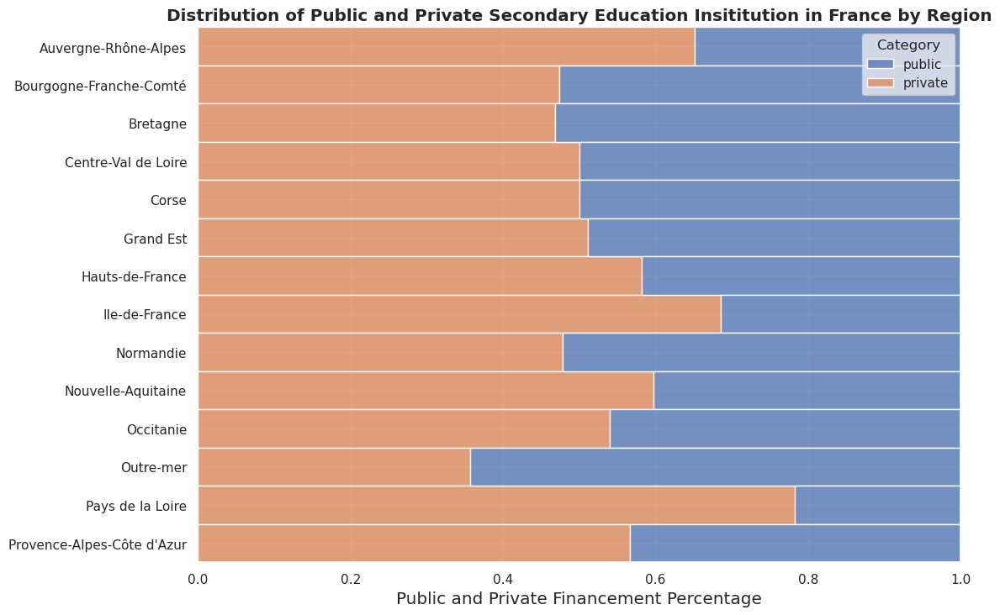

# Higher Education Institutions in France - Dataset

This repository contains a dataset of higher education institutions in France.  This includes 720 higher education institutions in France consisting of Universities and Business, Art, Political Science & Engineering Schools.

This dataset was generated based on Open Source datasets provided by the French National Office for Information on Education and Professions (*[ONISEP](https://www.onisep.fr/)*) and the French Ministry of Higher Education and Research (*[Ministère de l’Enseignement supérieur et de la Recherche](https://www.enseignementsup-recherche.gouv.fr/fr)*). The final dataset we provide is located at the following location, [./data_source/processed/merged-sieved-dataset.csv](./data_source/processed/merged-sieved-dataset.csv).

The data is being made publicly available to promote open science principles.

## Data

The data includes the following fields for each institution:

- Id: A unique identifier assigned to each institution.
- Region: The administrative region in which the institution is located. The islands of Guadeloupe, Guyane, La Réunion, Martinique and Mayotte are all placed in the *Outre-Mer* region.
- Name: The full name of the institution.
- Category: Indicates whether the institution is public or private.
- Url: The website of the institution.

## Methodology

The methodology for creating the dataset involved obtaining data from two open-source datasets is defined below and can be reproduced by executing the python notebook [./data-processing.ipynb](./data-processing.ipynb).

1. The *ONISEP* organization provides a dataset of secondary higher education institutions[2]. This dataset is filtered to only keep institution types of interest (Universities and Business, Art, Political Science & Engineering Schools) and those who deliver a diploma of level 6 or above (European Qualification Level). Additionally, we only kept institutions that are not sub-institutions, attached to other main structures. This dataset does not contain the website of the institutions, it is thus merged with another dataset provided by the same governmental institutions[3].

2. The French Ministry of Higher Education and Research provides a list of the most important secondary Higher Education Institutions[1]. This dataset contains some
establishments without a URL or located abroad (french high schools abroad), which are removed after manual inspection.

Finally, both processed datasets were merged as they are partly complementary. All entries were manually verified to remove and clarify any incoherencies that were present in these datasets. The tables are merged based on a unique identifier provided by the French government (UAI code). In France, several institutions have several locations around the country. To tackle this, we remove all duplicate Institutions which are located in the same region. To not bias certain regions, our dataset thus contains duplicate url's from institutions that have institutions in several regions.

Overall, this methodology ensured that the French HEIs dataset contains accurate and reliable information about registered HEIs in France.

## Usage

This data is available under the Creative Commons Zero (CC0) license and can be used for academic research purposes. We encourage the sharing of knowledge and the advancement of research in this field by adhering to open science principles.

If you use this data in your research, please cite the source and include a link to this repository. To properly attribute this data, please use the following DOI: TBA.

## Contribution

If you have any updates or corrections to the data, please feel free to open a pull request or contact us directly. Let's work together to keep this data accurate and up-to-date.

## References

1. Main higher education establishments provided by the Ministry of Higher Education and Research. Available: [data.gouv.fr/fr/datasets/principaux-etablissements-d-enseignement-superieur-mesr](https://www.data.gouv.fr/fr/datasets/principaux-etablissements-d-enseignement-superieur-mesr/#/resources) (accessed 15 March 2024).

2. French National Office for Information on Education and the Professions (*ONISEP*) - Dataset on secondary Higher Education Structures. Available: [opendata.onisep.fr/data/5fa586da5c4b6/2-ideo-structures-d-enseignement-superieur.htm](https://opendata.onisep.fr/data/5fa586da5c4b6/2-ideo-structures-d-enseignement-superieur.htm) (Accessed March 2024).

3. French National Office for Information on Education and the Professions (*ONISEP*) - Dataset on diplomas issued by Higher Education institutions. Available: [opendata.onisep.fr/data/605344579a7d7/2-ideo-actions-de-formation-initiale-univers-enseignement-superieur.htm](https://opendata.onisep.fr/data/605344579a7d7/2-ideo-actions-de-formation-initiale-univers-enseignement-superieur.htm) (Accessed March 2024).
